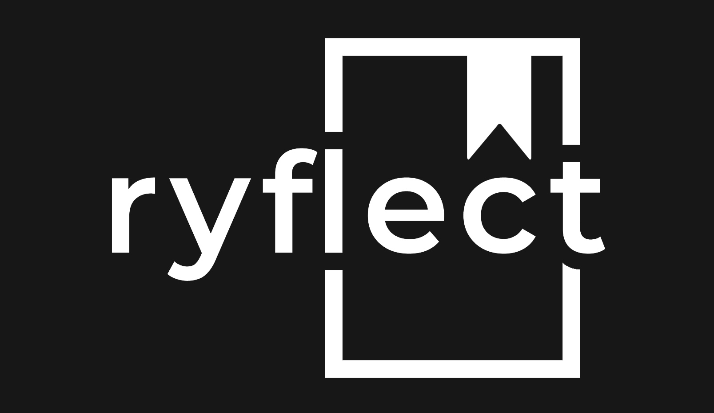
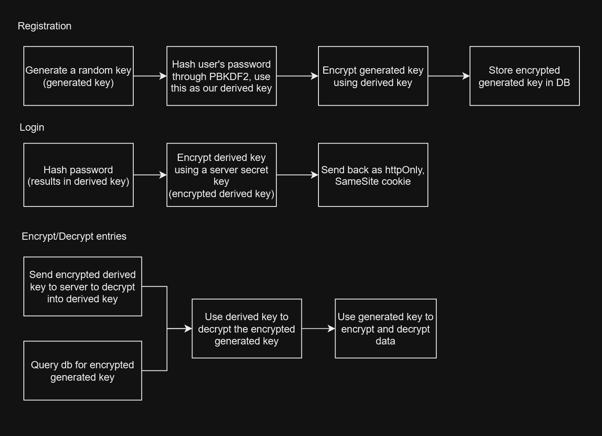
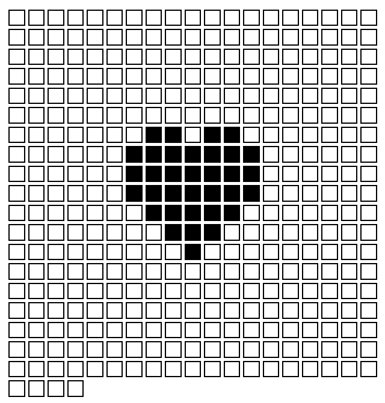

<p align="center">
    
</p>

## What is it?

[ryflect](https://ryflect.ca) is a once-a-day journaling MERN app with a focus on providing an intuitive platform to write journals, with the ability to leave journals for yourself that you can only open in the future.
It is made to provide a clean UI, encrypted data, an easy visualization of your writing habits each year, and an uncluttered workflow to write down your thoughts each day.

## How is info secured?

This diagram outline the process in which information is stored/retrieved in the database, and which user action triggers it:

<p align="center">
    
</p>

A common question is 'what is the point of a generated key, why not just rely on the derived key?

This decision was made in order to allow the user to change their password if they wish, since it simply becomes a matter of decrypting the generated key, then re-encrypting it with the new derived key using their new hashed password, a very quick and inexpensive operation.
Of course though, as a byproduct of encrypting user data means that passwords cannot be reset if the old one is forgotten. 

## How do I run this?

* Note: dependencies are installed with NPM

- After pulling in the repository, navigate to the client and server and install dependencies
```
    cd server
    npm install
    cd ../client
    npm install
```

- Go into the server directory and create a .env file (ryflect/server/.env) this is the structure:
```
PORT=5000
MONGO_URL=mongodb://127.0.0.1:27017/ryflect?directConnection=true&serverSelectionTimeoutMS=2000
JWT_SECRET=<any random bytes>
GMAIL_USERNAME= ... #gmail username
GMAIL_APP_PASSWORD= ... #app password found in less-secure app settings on gmail
WEBAPP_URL='http://localhost:3000' #Or whatever port the client will be running on

TEST_EMAIL= ... #all dev emails will be sent to the address you put here.
```

- Run the backend
```
node index.js
```

- Navigate to the client and run the frontend
```
cd ryflect/client
npm start
```

- Note: If you'd like to build it the front end, run either
```
npm run build:dev
or
npm run build:prod
```
    - To run the server as a production app, change the NODE_ENV variable (on linux it would look like):
    ```
    export NODE_ENV=production&&node index.js 
    ```

## Planned features?

Some things I'd like to add are:
 - Titles for journals
 - Mood tracking each day

<p align="center">
    
</p>
